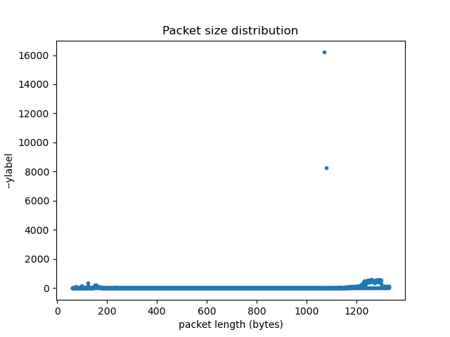

# zoompcap: A Zoom-to-RTP Trace Converter

By [Chema Gonzalez](https://github.com/chemag), 2021-10-12


# 1. Introduction
zoompcap is a tool for converting tcpdump (pcap) traces containing Zoom captures into RTC (real-time communications) captures. Zoom (as of 202110) uses a proprietary header between UDP and RTP that makes RTP parsing impossible. zoompcap just removes it.


# 2. Operation

zoompcap accepts a pcap packet trace containing a Zoom trace. It removes all the traffic but the audio and video packets (See discussion on Sections 3.1 and 3.2). For the audio and video packets, it removes the Zoom proprietary header, which allows further analysis of the media using RTP-oriented tools (e.g. [rtpcap](https://github.com/chemag/rtpcap)).


## 2.1. Installation

zoompcap requires access to the pcapy and impacket packets in python. For the impacket package, you can install the default distribution. E.g. using pip:

```
$ sudo pip install impacket
```

For pcapy, you need a special version (vanilla pcapy does not allow modifying the pkthdr contents. We have an open [pull request](https://github.com/helpsystems/pcapy/pull/65) for the addition, but the upstream package seems to have no activity in the last year.

```
$ git clone https://github.com/chemag/pcapy/
$ cd pcapy
$ sudo python setup.py install
```

## 2.2. Running

In order to remove the Zoom header from `test/zoom01.pcap`, use:

```
$ bin/zoompcap.py test/zoom01.pcap /tmp/foo.pcap
```

The output file is `/tmp/foo.pcap`.


# 3. Analysis
We captured a couple of Zoom traces, and tried to understand the structure of the proprietary header. A Zoom trace includes lots of UDP traffic between the same 5-tuple, with the following contents after the UDP header:

* (1) Headers containing RTP traffic. These look like RTP packets: We can see a "0xbede" 2-byte string in all the packets, which is the mark for the 1-byte Generic RTP Header Extensions (see [rfc5285](https://datatracker.ietf.org/doc/html/rfc5285)). If we move back 12 bytes from the "0xbede" 2-byte string, we found the first 2 bits to be "10" (which means version 2 in RTP). Here we find both video and audio patterns: For video, packet lengths in the 300-1300 range, with more packets in the higher sizes. For audio, smaller packets (between 100 and 400 bytes). They account for ~70%% of the packets.

On these packets, the proprietary header length has different lengths: 24, 19, other.

An example of this type of packets is (1165-byte packet, probably video):

```
100100fb  9019180c
0101c11e  42d47a02
00000000  0204bd07
-- beginning of RTP header
90624f89  1fd175a4
01000801  01bede00 <-- note the RTP 0xbede marker
```

There seems to be a differentiation between client-to-server and server-to-client traffic:

Example of client-to-server traffic:

```
100100fb 9010180c  01006611 ef54d200  00000000 0200000d
100100fb 9010180c  01006711 ef54f000  00000000 0200000d
100100fb 9010180c  01006811 ef54f000  00000000 0200000d
100100fb 9010180c  01006911 ef550e00  00000000 0200000d
```

Example of server-to-client traffic:
```
100100fb 9019180c  ff00051e 421e5e00  00000000 02000008
100100fb 9019180c  ff00061e 421e7c00  00000000 02000008
100100fb 9019180c  ff00071e 421e7c00  00000000 02000008
100100fb 9019180c  ff00081e 421e9a00  00000000 02000008
```

Another example of this type of packets is (167-byte packet, probably audio);

```
0f0100fb  90131104
01076f1e  42d45c00
01006a
-- beginning of RTP header
90  705bd700
16db4001  000802bede  <-- note the RTP 0xbede marker
```

There also seems to be a differentiation between client-to-server and server-to-client traffic:

Example of client-to-server traffic:

```
0f0100fb 90131104  01000011 ef4f0a00  01003d
0f0100fb 90131104  01000111 ef4f6400  01003d
0f0100fb 90131104  01000211 ef4fdc00  01003d
0f0100fb 90131104  01000311 ef503600  01003d
0f0100fb 90131104  01000411 ef50ae00  01003d
```

Example of server-to-client traffic:
```
0f0100fb 90131104  ff00001e 421de600  010061
0f0100fb 90131104  ff00011e 421de600  030066
0f0100fb 90131104  ff00021e 421e0400  030057
0f0100fb 90131104  ff00031e 421e2200  030069
```

* (2) Non-RTP Packets, starting with 0x1501000000. These packets look like some proprietary network control protocol: They are clearly not RTP, nor encrypted. In fact, the packets show little entropy (most of the content is the same byte repeated again and again). The size is almost always around 1070 bytes. They account for 28% of the packets in a given trace.



Figure 1 shows the distribution of packet lengths on a given Zoom packet trace. Note the huge peak around 1070 in the distribution of packet lengths.


Example of packets:
```
15010000 00000203  0033010d 01000011  ef4f2800 000003e8  00000000 01010101  ...
15010000 00000203  0033010d 01000111  ef4f2800 000003e8  00000000 02020202  ...
15010000 00000203  0033010d 01000211  ef4f2800 000003e8  00000000 03030303  ...
15010000 00000203  0033010d 01000311  ef4f4600 000003e8  00000000 01010101  ...
15010000 00000203  0033010d 01000411  ef4f4600 000003e8  00000000 02020202  ...
15010000 00000203  0033010d 01000511  ef4f6400 000003e8  00000000 01010101  ...
```


* (3) Other non-RTP Packets. These account for an insignificant part of the packets.


# Requirements
The analysis script requires:
* a functioning `tshark` binary
* the [rtpcap](https://github.com/chemag/rtpcap) analysis tool installed in `~/proj/`
* the [plotty](https://github.com/chemag/plotty) plotting tool installed in `~/proj/`

Works with:
* Linux
* Mac OS X


## License
zoompcap is BSD licensed, as found in the [LICENSE](LICENSE) file.


## Other

[Terms of use](https://opensource.facebook.com/legal/terms).

[Privacy Policy](https://opensource.facebook.com/legal/privacy).

